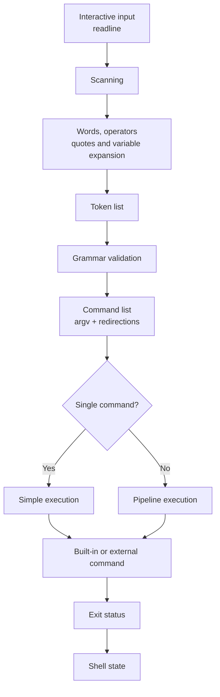

# minishell

> An interactive Unix shell written in C, exploring command processing,
> process orchestration, pipelines, redirections, environment state and signals.

## At a Glance

| | |
| --- | --- |
| **Language** | C |
| **Environment** | Unix / Linux |
| **Domain** | Systems Programming |
| **Interface** | Interactive CLI |
| **Team** | 2 developers |
| **Original context** | 42 Porto Common Core |
| **Scope** | Mandatory minishell implementation |
| **Build** | Make + GNU Readline |
| **Status** | Original project complete, maintained as a portfolio project |

## Overview

`minishell` is an interactive Unix shell implemented in C.

The project explores how a shell transforms user input into executable work:
reading an interactive command line, processing words and operators, building
a command representation, configuring file descriptors, creating processes and
finally executing built-ins or external programs.

Rather than delegating command interpretation to an existing shell, the
implementation manages its own command-processing pipeline, environment state,
redirections, process creation, pipelines and signal behaviour.

The project was originally developed collaboratively as a two-person project
during the 42 Porto Common Core. The repository is now maintained as a
portfolio project while preserving the original development history and
attribution.

## Architecture

The implementation is divided into small subsystems with explicit
responsibilities.



### Runtime flow

The current implementation follows approximately:

```text
readline
   ↓
scan input + expand words
   ↓
token list
   ↓
validate grammar
   ↓
command list
   ↓
prepare execution
   ↓
built-in / fork / pipe / execve
   ↓
wait + collect exit status
   ↓
cleanup
   ↓
next prompt
```

Variable expansion is performed while words are scanned rather than through a
separate post-parsing expansion pass.

## Core Data Model

The shell uses a deliberately small command model rather than a full abstract
syntax tree.

| Structure | Responsibility |
| --- | --- |
| `t_shell` | Persistent environment, last exit status and session exit state |
| `t_token` | Word or shell operator produced during input scanning |
| `t_redir` | One input, output, append or heredoc redirection |
| `t_cmd` | Command arguments, redirections and next pipeline stage |
| `t_child_ctx` | Resources required during child execution |
| `t_pipe_state` | File descriptors and process state used while building a pipeline |

This model keeps mandatory shell syntax relatively simple while separating
persistent shell state from temporary per-command resources.

## Features

### Interactive Session

- Interactive prompt powered by GNU Readline
- Command history
- Clean handling of empty input
- `Ctrl-C`, `Ctrl-D` and `Ctrl-\` behaviour appropriate to interactive use
- Persistent exit status available through `$?`

### Input Processing

The scanner recognises:

- words
- single-quoted segments
- double-quoted segments
- pipes: `|`
- input redirection: `<`
- output redirection: `>`
- heredoc: `<<`
- append redirection: `>>`

Adjacent quoted and unquoted segments are combined into a single argument.

Single quotes preserve their content literally.

Double-quoted and unquoted text support environment-variable expansion.

### Variable Expansion

Supported expansion includes:

```bash
$HOME
$USER
$PATH
$?
```

Environment variables are resolved against the shell's internal environment
state.

`$?` expands to the exit status of the previous command or pipeline.

### Built-ins

The following built-ins are implemented:

| Built-in | Purpose |
| --- | --- |
| `echo` | Print arguments, including required `-n` behaviour |
| `cd` | Change the shell's working directory |
| `pwd` | Print the current working directory |
| `export` | Add or update environment entries |
| `unset` | Remove environment entries |
| `env` | Print the current environment |
| `exit` | Terminate the shell |

Standalone built-ins execute in the parent shell process in the current
implementation, allowing state changes such as `cd`, `export`, `unset` and
`exit` to persist.

When a built-in is part of a pipeline, it executes in a child process like any
other pipeline stage so that its state changes do not incorrectly affect the
parent shell.

### External Commands

External programs can be executed either through direct paths:

```bash
/bin/echo hello
./program
```

or by resolving command names through `PATH`:

```bash
ls
grep
cat
```

Execution uses the Unix `fork()` / `execve()` process model.

The implementation distinguishes common execution failures, including
command-not-found and non-executable targets, and propagates meaningful exit
statuses.

### Pipelines

Multiple commands can be connected using Unix pipes:

```bash
printf 'a\nb\nc\n' | cat | wc -l
```

Pipeline stages are created as separate child processes.

The implementation maintains only the file descriptors needed for the current
pipeline stage and closes unused pipe ends as execution progresses.

The parent waits for all pipeline children and uses the exit status of the
final pipeline process as the pipeline result.

### Redirections

Supported redirections are:

```text
<      input
>      output with truncation
>>     output with append
<<     heredoc
```

Redirections are stored independently from command arguments and applied during
execution.

Multiple redirections affecting the same stream are processed in source order,
with the final applicable redirection becoming the effective input or output.

Standalone built-ins temporarily save and restore the parent's standard input
and output so that redirections do not leak into the next prompt.

### Heredoc

Heredoc input is collected in a dedicated child process and transported through
a pipe to the command that consumes it.

```bash
cat << EOF
hello
EOF
```

The implementation also handles interruption and premature EOF during heredoc
input.

See [Current Scope and Limitations](#current-scope-and-limitations) for the
current expansion behaviour inside heredocs.

### Signals

Signal behaviour changes according to execution context.

The shell distinguishes between:

- interactive prompt handling;
- heredoc input;
- a parent waiting for foreground children;
- child-process execution.

Interactive `SIGINT` refreshes the prompt and updates shell status, while
foreground child processes restore normal signal behaviour.

This keeps asynchronous signal handling separate from parser, environment and
command state.

## Project Structure

```text
.
├── include/
│   └── minishell.h
├── libft/
├── src/
│   ├── builtins/
│   ├── exec/
│   ├── expand/
│   ├── grammar/
│   ├── scan/
│   ├── session/
│   ├── signals/
│   ├── state/
│   └── support/
├── docs/
├── Makefile
├── LICENSE
└── README.md
```

| Module | Responsibility |
| --- | --- |
| `session` | Interactive loop and per-line execution |
| `scan` | Input scanning, quotes, tokens and word construction |
| `expand` | Environment-variable and `$?` expansion |
| `grammar` | Command/pipeline construction and syntax validation |
| `exec` | Commands, processes, pipelines, redirections and heredocs |
| `builtins` | Shell built-ins |
| `state` | Persistent environment management |
| `signals` | Context-specific signal policies |
| `support` | Shared low-level helpers |
| `libft` | Supporting C utility library |

## Build

### Requirements

The project requires:

- a C compiler;
- `make`;
- GNU Readline development headers and library;
- a Unix-like environment.

Clone the repository and build:

```bash
git clone https://github.com/LuisQAlmeida/42Minishell.git
cd 42Minishell
make
```

Run the shell:

```bash
./minishell
```

Available Make targets:

```bash
make
make clean
make fclean
make re
```

The project is compiled with:

```text
-Wall -Wextra -Werror
```

## Example Session

```console
$ ./minishell
minishell$ echo "Hello $USER"
Hello user

minishell$ export PROJECT=minishell
minishell$ echo $PROJECT
minishell

minishell$ printf 'one\ntwo\nthree\n' | wc -l
3

minishell$ echo hello > output.txt
minishell$ cat < output.txt
hello

minishell$ definitely_not_a_command
minishell: definitely_not_a_command: command not found

minishell$ echo $?
127
```

Environment-dependent output may differ.

## Engineering Highlights

### Parent vs Child Built-in Execution

A shell cannot implement state-changing commands such as `cd` by always
executing them in child processes: changes made by the child would disappear
when that process exits.

Standalone built-ins therefore execute in the shell process, while pipeline
built-ins execute as child processes.

### File-Descriptor Ownership

Pipeline execution uses a rolling file-descriptor model rather than keeping
every pipe open for the entire pipeline.

Unused descriptors are closed as soon as they are no longer required,
preventing descriptor leaks and ensuring downstream processes can observe EOF.

### Parent Redirection Restoration

Running a built-in directly in the parent introduces another problem:
redirections temporarily modify the shell's own `stdin` or `stdout`.

The implementation therefore follows:

```text
save standard descriptors
        ↓
apply command redirections
        ↓
execute built-in
        ↓
restore standard descriptors
```

### Exit-Status Propagation

The shell stores the result of the latest foreground command in persistent
state.

For pipelines, all children are waited for while the status associated with
the final pipeline process becomes the pipeline result.

That value is subsequently available through `$?`.

### Context-Sensitive Signals

The interactive shell, heredoc reader, waiting parent and executing child use
different signal policies.

This avoids treating asynchronous input as if every process were in the same
execution state.

## Testing and Validation

The maintained testing documentation defines how the current repository is
validated and distinguishes current checks from historical project evidence.

See:

- [`docs/testing/validation-strategy.md`](docs/testing/validation-strategy.md)
  for validation layers, expectations by change type, CI boundaries and known
  testing gaps;
- [`docs/testing/manual-validation.md`](docs/testing/manual-validation.md)
  for reproducible manual checks covering shell behaviour, signals, memory,
  file descriptors and repository changes.

The current GitHub Actions workflow provides automated build-integration
validation on pull requests and pushes to `main`. It performs a clean build,
verifies the expected executable and checks that an unchanged second `make`
does not relink it.

The CI baseline and its failure semantics are documented in
[`docs/development/continuous-integration.md`](docs/development/continuous-integration.md).

The workflow also provides an independent Clang compiler-diversity quality
check through `CI / quality`.

The quality-tool evaluation and rationale are documented in
[`docs/development/static-analysis.md`](docs/development/static-analysis.md).

The workflow does not currently provide an automated behavioural regression
suite, resource checks, general static-analysis gates or coverage reporting.

Original 42 evaluation preparation and project-era validation evidence remain
preserved under
[`docs/history/validation/`](docs/history/validation/), including the original
mandatory manual test matrix.

Historical PASS results are evidence of the original project validation, not
claims that the current baseline is automatically revalidated.

Automated regression testing, resource-oriented automation and any future
general static-analysis gates remain separate modernization work.

## Current Scope and Limitations

This implementation focuses on the mandatory 42 minishell scope and is not
intended to be a complete POSIX shell.

The current baseline does not implement optional syntax such as:

```text
&&
||
()
*
```

or additional shell grammar such as command grouping and wildcard expansion.

### Heredoc Expansion

The current implementation writes heredoc body lines to its input pipe
verbatim.

Environment-variable and `$?` expansion inside heredoc bodies is therefore not
implemented in this baseline.

This behaviour is documented explicitly so that the portfolio describes the
code as it exists rather than implying functionality that is not present.

## Documentation

Additional project material lives under [`docs/`](docs/).

The repository currently includes:

- architecture and design notes;
- development decisions;
- planning material;
- project-management conventions;
- evaluation preparation;
- the original project subject.

Some architecture documents were created during development and describe the
intended design rather than every detail of the final implementation. They are
being reconciled with the final code as part of the repository modernization
initiative.

## Contributing

Current contribution and repository-maintenance guidance is available in
[`CONTRIBUTING.md`](CONTRIBUTING.md).

The detailed issue, branch, commit, validation, pull-request, squash-merge and
cleanup workflow is documented in
[`docs/development/git-workflow.md`](docs/development/git-workflow.md).

The maintained workflow uses GitHub Issues for current work tracking while
preserving the original Jira-based team workflow separately as project
history.

## Project History

This project was originally developed collaboratively by a two-person team
during the 42 Porto Common Core.

The Git history and original contributor attribution are intentionally
preserved.

The repository state immediately before its professional portfolio
modernization is preserved by the annotated tag:

```text
portfolio-baseline-2026-08
```

Subsequent documentation, tooling, quality improvements and future extensions
are maintained separately from the historical project baseline.

Repository modernization is tracked through
[issue #26](https://github.com/LuisQAlmeida/42Minishell/issues/26).

## Future Evolution

The portfolio roadmap includes improving:

- architecture documentation;
- automated testing and CI;
- deeper static-analysis and quality auditing;
- API documentation;
- resource-ownership documentation;
- regression testing;
- additional technical exploration beyond the original 42 scope.

Future extensions will remain distinguishable from the original 42
implementation.

## License

This repository is distributed under the terms of the
[MIT License](LICENSE).
