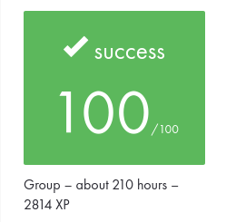

# Academic Project Context

This page records the academic context of **Minishell** as completed within the
42 Common Core and distinguishes that evaluated collaborative project from the
later maintained portfolio version of this repository.

## Project Record

| Field | Value |
| --- | --- |
| Project | `minishell` |
| Curriculum | 42 Common Core |
| Campus | 42 Porto |
| Supplied subject reference | Version 10.0 |
| Final evaluation | **100/100** |
| Project type | Group — 2 students |
| Estimated curriculum workload | About 210 hours |
| Curriculum XP | 2814 XP |
| Peer evaluations | 3/3 completed |

The workload value above is the estimate displayed by the 42 project record. It
is not presented as a measurement of the time personally spent by either team
member.

## Evaluation

The original 42 project received a final evaluation of **100/100**.

The image is a privacy-conscious crop of the original 42 Intra project record.
It retains only the project-result information relevant to this portfolio:
score, project mode, estimated curriculum workload and XP.

The supplied project record also shows three completed peer evaluations, each
recorded at 100%.

## Collaboration

Minishell was developed as a two-person project by:

- Luís Quental Almeida;
- João da Silva (`@xSilverWasHere`).

The repository's Git history preserves contributions from both developers,
including project-era commits, merges and co-authorship metadata.

Historical workflow documentation also preserves evidence of the original team
process, including Jira-based work tracking, short-lived branches, pull
requests, working agreements and shared review practices.

## Subject Reference

The subject document preserved in the repository's historical record identifies
the project specification as **Minishell version 10.0**.

The original 42 subject PDF is intentionally not redistributed in the current
public repository.

The academic specification is therefore recorded here as:

- **Project:** `minishell`
- **Subject reference:** Version 10.0
- **Curriculum:** 42 Common Core
- **Campus:** 42 Porto

The PDF remains recoverable from Git history and the immutable historical
baseline. Recording version 10.0 here preserves traceability without
republishing the curriculum document.

The subject reference is not presented as independent proof that this was the
exact revision served by the 42 platform on the evaluation date.

## Academic and Maintained States

The project was completed and evaluated as part of the 42 Common Core.

The current `main` branch is a later maintained portfolio edition. It contains
post-project engineering work including correctness fixes, dependency
maintenance, automated regression testing, CI, API documentation, repository
curation and broader documentation improvements.

The annotated tag:

`portfolio-baseline-2026-08`

preserves the repository state immediately before professional portfolio
modernization began.

That baseline is historical provenance for the repository. It is **not**
presented as proof that the tagged commit is the exact commit evaluated by 42.

The tag `v1.0.0` identifies the first maintained portfolio release. Later work
on `main` does not move or rewrite that release.
