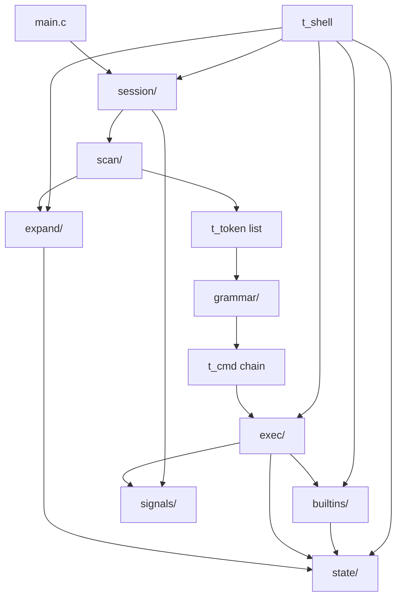

# System Overview

This document describes the maintained architecture of Minishell as implemented
in the current source tree.

It focuses on system boundaries, subsystem responsibilities, the core runtime
data model and the distinction between persistent shell state and
per-command execution state.

For the detailed command lifecycle, see `runtime-flow.md` once that document is
available.

## Architectural Overview

Minishell is an interactive command interpreter organized as a set of small C
subsystems around a persistent shell session.

At a high level, input moves through the following stages:

```text
interactive input
      |
      v
session management
      |
      v
scan + quote-aware expansion
      |
      v
token list
      |
      v
grammar
      |
      v
command chain
      |
      v
execution
      |
      v
exit status + persistent shell state
```

Variable expansion is performed while words are scanned, not as a separate
post-parse phase.

This allows the scanner to apply different expansion behaviour while quote
context is still available.

## System Boundaries

The maintained implementation is divided into the following source domains:

| Domain | Responsibility |
| --- | --- |
| `main.c` | Validates invocation and enters the shell session |
| `session/` | Owns the interactive lifecycle and per-line command lifecycle |
| `scan/` | Recognizes words and shell operators and constructs tokens |
| `expand/` | Expands environment variables and the previous exit status |
| `grammar/` | Converts tokens into executable command structures |
| `exec/` | Executes commands, pipelines, redirections, heredocs and external programs |
| `builtins/` | Identifies and executes supported shell builtins |
| `state/` | Owns environment lookup and mutation operations |
| `signals/` | Installs signal policies for different runtime contexts |
| `support/` | Provides small shared utility functions |

These domains describe the final source organization rather than the earlier
design structure preserved under `docs/history/design/`.

## High-Level Component Relationships



The diagram shows logical dependencies rather than ownership of every
individual allocation or file descriptor.

Resource ownership is documented separately in `resource-ownership.md`.

## Session Boundary

The persistent runtime state of the interactive shell is represented by
`t_shell`:

```c
typedef struct s_shell
{
    char    **envp;
    int     last_status;
    int     should_exit;
}   t_shell;
```

The session initializes this structure once when Minishell starts.

Its lifetime spans multiple command lines.

### `envp`

`envp` is an owned mutable copy of the process environment received by
`main()`.

The state subsystem provides operations to:

- copy the initial environment;
- look up variables;
- add or replace entries;
- remove entries;
- create `KEY=value` entries.

Builtins such as `export`, `unset` and `cd` modify this shell-owned environment.

### `last_status`

`last_status` stores the result of the most recently executed command or
pipeline.

It is also the source used when expanding `$?`.

### `should_exit`

`should_exit` allows the `exit` builtin to request termination of the
interactive session without bypassing normal session cleanup.

## Persistent and Transient State

A central architectural boundary is the distinction between session-persistent
state and objects created for one command line.

### Persistent state

```text
t_shell
└── envp
    last_status
    should_exit
```

This state survives across prompt iterations.

### Per-line state

```text
readline input
      |
      v
t_token list
      |
      v
t_cmd chain
      |
      +-- argv
      |
      +-- t_redir list
```

These objects exist only for the processing and execution of one input line and
are released before the next command is processed.

Execution may additionally create short-lived child processes, pipes, heredoc
pipes and redirection file descriptors.

## Input Representation

### Tokens

The scanner represents lexical output using `t_token`:

```c
typedef struct s_token
{
    t_toktype       type;
    char            *value;
    struct s_token  *next;
}   t_token;
```

Supported token types are:

- `TOK_WORD`;
- `TOK_PIPE`;
- `TOK_REDIR_IN`;
- `TOK_REDIR_OUT`;
- `TOK_HEREDOC`;
- `TOK_APPEND`.

Operators do not require string values.

Word tokens own the strings produced by scanning and expansion.

## Scanning and Expansion

The scanner processes the input line while preserving enough context to
distinguish:

- unquoted text;
- single-quoted text;
- double-quoted text;
- shell operators.

Expansion behaviour is determined while each word is being assembled:

| Input context | Variable expansion |
| --- | --- |
| unquoted segment | yes |
| single-quoted segment | no |
| double-quoted segment | yes |

The expansion subsystem currently handles:

- `$NAME`;
- `$?`;
- literal `$` when it is not followed by a valid expansion target.

After scanning, quote delimiters are no longer represented explicitly in the
token model.

This is why expansion belongs to the scanning stage in the maintained
implementation.

## Command Representation

The grammar subsystem converts the token stream into a linked list of `t_cmd`
objects:

```c
typedef struct s_cmd
{
    char            **argv;
    int             argc;
    t_redir         *redirs;
    struct s_cmd    *next;
}   t_cmd;
```

Each node represents one command stage.

A pipeline is represented by linking multiple command nodes:

```text
t_cmd -> t_cmd -> t_cmd -> NULL
```

There is no separate pipeline object and no general shell AST in the maintained
implementation.

### Arguments

Word tokens that are not redirection targets are copied into the command's
null-terminated `argv` array.

The command representation owns these copies independently of the token list.

### Redirections

Redirections are represented separately from command arguments:

```c
typedef struct s_redir
{
    t_toktype       type;
    char            *target;
    int             fd;
    struct s_redir  *next;
}   t_redir;
```

The grammar preserves redirections in source order.

Each redirection stores:

- its operator type;
- an owned copy of its target;
- an optional prepared file descriptor;
- a link to the next redirection.

The `fd` field starts at `-1` and may temporarily own a descriptor prepared for
execution.

Detailed descriptor ownership is covered by `resource-ownership.md`.

## Execution Boundary

After grammar construction, the session dispatches according to the number of
commands:

```text
one t_cmd
    |
    v
exe_simple()

multiple t_cmd nodes
    |
    v
exe_pipeline()
```

The execution subsystem is responsible for:

- standalone command execution;
- child-process creation;
- external command resolution;
- pipeline construction;
- redirection preparation and application;
- heredoc collection;
- child waiting;
- exit-status conversion.

Standalone builtins execute in the parent shell so that changes to persistent
state can survive the command.

Builtins used as pipeline stages execute in child processes, so state changes
remain local to the child.

## Builtin Boundary

The builtin subsystem supports:

- `echo`;
- `pwd`;
- `env`;
- `export`;
- `unset`;
- `cd`;
- `exit`.

`blt_execute()` provides common dispatch.

The execution context determines whether that dispatch occurs in the persistent
parent shell or in a child process.

This distinction is especially important for stateful builtins such as `cd`,
`export`, `unset` and `exit`.

## External Commands

External commands eventually execute through `execve()`.

Commands containing `/` are treated as direct paths.

Commands without `/` are resolved through the shell-owned `PATH` environment
value before execution.

Execution error handling and status conversion remain responsibilities of the
execution subsystem rather than the PATH lookup helper.

## Runtime Working Contexts

In addition to the main persistent and command data structures, the
implementation uses small context structures for localized runtime work.

### `t_tokctx`

Carries scanner state while processing one input line:

- source line;
- current index;
- token-list head;
- shell state;
- error state.

### `t_child_ctx`

Carries references to command and session resources used during execution and
for child-local cleanup:

- command-chain pointer;
- token-list pointer;
- shell-state pointer.

This context allows execution children to release their inherited process-local
copies before exit.

### `t_pipe_state`

Tracks the rolling state required while constructing a pipeline:

- previous-stage read descriptor;
- current pipe descriptors;
- PID of the most recently launched stage.

The pipeline therefore does not require a persistent array containing all pipe
pairs.

## Signal Boundary

Signal behaviour depends on the current runtime context rather than using one
global policy for every process state.

The implementation distinguishes policies for:

- interactive input;
- a parent waiting for foreground children;
- execution children;
- heredoc input.

Detailed process and signal behaviour is documented in
`process-and-signals.md`.

## Architecture Constraints

The current architecture intentionally reflects the implemented project scope.

In particular:

- the grammar represents command chains rather than a general-purpose shell
  syntax tree;
- expansion is integrated with scanning;
- the environment is stored directly as an owned `char **`;
- pipeline construction uses rolling descriptor state;
- heredoc body variable expansion is not implemented in the current baseline;
- optional syntax such as `&&`, `||`, parentheses and wildcard expansion is
  outside the maintained baseline.

These constraints describe the current implementation and should not be
interpreted as requirements for future extensions.

## Historical Design Material

Earlier design documents are preserved under:

[`../history/design/`](../history/design/)

They remain useful for understanding the development process but are not the
authoritative description of the maintained architecture.

Where those documents disagree with this documentation, the current source code
and maintained architecture documentation take precedence.
